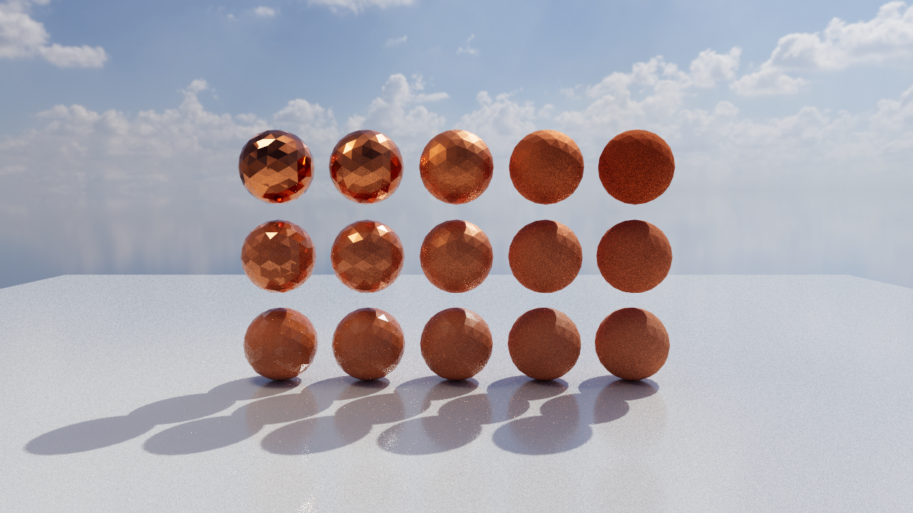
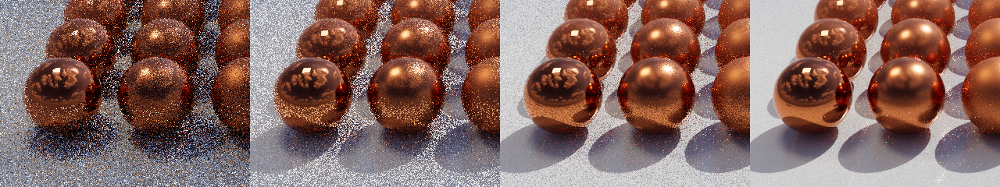
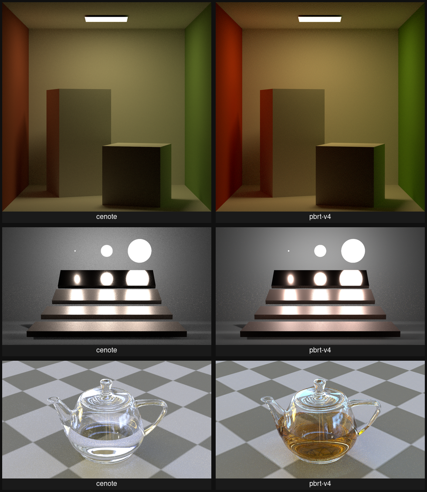

# Cenote

A portable, GPU-first, interactive-progressive production path tracer built on Vulkan
ray tracing, with GRIS/ReSTIR as its theoretical core. The defining thesis: **the
interactive lookdev preview and the converged final frame are the same estimator** —
no biased preview modes, no "final gather" switch. What the artist sees at one second
is an honest prediction of the frame at one hour.

Where CPU production renderers optimize for memory capacity on unbounded scenes,
Cenote makes the inverse bet: extreme single-GPU performance on scenes that fit in
VRAM. Wavefront compute + ray queries, one integrator, everything resident.

**Status: M2 complete** — the six-kernel wavefront engine
(indirect dispatch, zero mid-frame readbacks), Sobol-Burley sampling, the
full `OpenPBR` closure — coat, fuzz, rough glass with interior absorption,
thin-walled surfaces, variable IOR, fractional opacity — energy-compensated
against baked tables so a white furnace closes through every lobe, textured
materials through a bindless table (BC-compressed at prep with a DDS cache
beside each source, sRGB decoded in hardware, converted to the working
space in-shader) including tangent-space normal maps and per-texel opacity,
MIS-weighted next-event estimation of emissive meshes, delta lights, and an
importance-sampled HDRI, thin-lens depth of field, live-editable scene
files, a pbrt-v4 importer (`cenote-cli import`, or open a `.pbrt` in the
viewer directly) with a CC0 regression corpus rendered and FLIP-compared in
CI, AOVs (denoiser albedo/normal guides with Cycles-style specular
pass-through, first-hit depth) accumulated beside the beauty and written as
one multi-layer EXR, OIDN denoising over those guides (a CLI flag and a
viewer toggle, in builds with the `denoise` feature), a progressive viewer,
and a batch CLI that writes exactly the image the viewer converges to.



*The M1 demo: a material chart sweeping `OpenPBR` roughness (left to right)
and metalness (back to front), path traced under the Kloofendal sky's sun
and a warm quad key light. The spheres are coarse meshes shaded smooth by
interpolated vertex normals — the mirror-sharp front row is where a
shading-normal or energy bug would show first.*



*The thesis in one strip: 1, 8, 64, and 512 spp are the same estimator —
noise is the only difference between preview and final.*

## Next to pbrt-v4

The importer's real test is a side-by-side. Below are the three
regression-corpus scenes (Benedikt Bitterli's, CC0) imported and rendered
by cenote, beside [pbrt-v4](https://github.com/mmp/pbrt-v4) rendering the
same source files — two GPU renderers, one scene description, judged two
ways. Both images take the same sRGB display transform, so what parts them
is the renderers, not the tonemap.



*Equal work — 64 samples per pixel. The images agree on everything that
carries the scene: layout, materials, the light. Where they part is honest
and expected. Cenote's `OpenPBR` conductor is not pbrt's spectral one, so
the Veach plates catch the light a little differently. And cenote has no
volumetric medium yet, so the teapot's tea — an absorbing medium under
pbrt — pours as clear glass. pbrt reconstructs with a triangle filter where
cenote uses a box, so at matched samples its per-pixel noise sits slightly
lower.*


*Equal time — about two seconds of wall clock each, both on one RTX 4070 Ti
SUPER. In that budget cenote draws three to four times the samples — 280,
588, and 186 spp against pbrt's 68, 186, and 59 — and carries visibly less
grain. The gap is the estimator's throughput, not the hardware: same GPU,
same scene, same seconds.*

| Scene | Resolution | pbrt-v4 | cenote | per sample |
|---|---|---|---|---|
| `cornell-box` | 1024² | 21.6 ms/spp | 4.9 ms/spp | 4.4× |
| `veach-mis` | 1280×720 | 8.1 ms/spp | 2.6 ms/spp | 3.1× |
| `teapot-full` | 1280×720 | 23.5 ms/spp | 8.0 ms/spp | 3.0× |

*Steady-state cost per sample, both engines on one NVIDIA RTX 4070 Ti SUPER
(pbrt-v4 through its OptiX wavefront back end). Each render also carries
~0.5–0.8 s of fixed startup — Vulkan or OptiX init and the
acceleration-structure build — which the two-second budget above includes.*

pbrt renders spectrally and writes linear `Rec.709`; cenote renders RGB in
`ACEScg`. The comparison is perceptual — the same scene under the same
light, not the same pixels. The reference is pbrt-v4 at
[`5f7a606`](https://github.com/mmp/pbrt-v4/commit/5f7a606806a4ac7b939131ded9d7a30ebd02416e),
the commit this importer's semantics were verified against; strict pbrt-v4
wants a few spellings our lenient importer accepts without (`point3` for
`point`, unquoted booleans, no retired `WorldEnd`), translated for the
reference render only. These figures regenerate from a local pbrt build.

## Quickstart

Requires: stable Rust, [`slangc`](https://github.com/shader-slang/slang) on PATH
(CI pins 2026.9.1; any recent release should work), and a Vulkan GPU with
`VK_KHR_ray_query` support (any recent RT-capable card).

```sh
cargo run --release -p cenote-viewer   # orbit (drag), dolly (scroll), live exposure
cargo run --release -p cenote-viewer -- scenes/example.ron   # open a scene file — and edit it live
cargo run --release -p cenote-cli -- render --spp 256 --out shot.exr
cargo run --release -p cenote-cli -- import scene.pbrt --out scene.ron   # pbrt-v4 in, cenote scene out
```

The viewer accumulates forever and re-converges after every camera move. An
opened scene file is watched: save an edit — a color, a transform, the
lamp's brightness — and the viewer re-preps exactly what changed and
re-converges. A save that doesn't parse (or that this build can't render
yet) is logged and the previous scene keeps rendering.
`cenote-cli render` takes a scene file too (`.ron`, or a `.pbrt` imported
on the fly), accumulates `--spp` samples of the same estimator into the
same film, and writes one multi-layer EXR — linear `ACEScg` beauty
(chromaticities declared in the header), the denoiser's albedo and normal
guides, and first-hit depth as `Z`; with `--watch` it re-renders on
every shader edit, recompiling from the source checkout in under a second.
`import` converts pbrt-v4 scenes, printing every fidelity warning —
anything the importer drops or degrades is named, never silent.

### Denoising

Builds with the `denoise` feature add [Open Image
Denoise](https://www.openimagedenoise.org/), fed by the film's albedo and
normal AOV guides:

```sh
cargo run --release -p cenote-cli --features denoise -- render --spp 64 --denoise --out shot.exr
cargo run --release -p cenote-viewer --features denoise    # panel gains a denoise toggle
```

`--denoise` writes a second EXR (`shot.denoised.exr`) beside the raw one —
the estimator's output is never replaced. The viewer's toggle re-denoises
the accumulating frame about once a second.

The feature links the system OpenImageDenoise library. If your install has
a pkg-config file the build finds it alone; otherwise point `OIDN_DIR` at a
directory whose `lib/` contains `libOpenImageDenoise.so` — an extracted
[official release](https://github.com/RenderKit/oidn/releases), or a
symlink to your distro's versioned library (Fedora's `oidn-libs` ships only
`libOpenImageDenoise.so.2`, so: `mkdir -p ~/.local/opt/oidn/lib && ln -s
/usr/lib64/libOpenImageDenoise.so.2
~/.local/opt/oidn/lib/libOpenImageDenoise.so`). Setting it once in
`~/.cargo/config.toml` covers every build:

```toml
[env]
OIDN_DIR = "/home/you/.local/opt/oidn"
```

## Tests and goldens

```sh
cargo test --workspace
```

runs everything; tests that need a GPU skip cleanly (with a note on stderr)
where there isn't one. The golden-image tests render the demo scene and
compare it against the reference EXRs in `crates/cenote/tests/golden/` with
[ꟻLIP](https://github.com/NVlabs/flip), a perceptual metric whose threshold
survives the floating-point reordering that driver and compiler updates cause.
A failure dumps the actual render and a FLIP heatmap (black = identical,
bright = different) into `target/tmp/` — open them in `tev` next to the golden.

After an **intentional** image change, regenerate the goldens and eyeball them
before committing:

```sh
UPDATE_GOLDENS=1 cargo test -p cenote --test golden        # the demo scene
UPDATE_GOLDENS=1 cargo test -p cenote-pbrt --test corpus   # the pbrt corpus
```

### Pre-push ritual

CI has no GPU, so everything image-shaped runs here, before pushing:

```sh
cargo fmt --all --check
cargo clippy --workspace --all-targets -- -D warnings
cargo test --workspace   # on the GPU machine — includes the goldens
```

## Repo map

| Path | What lives there |
|---|---|
| `crates/cenote/` | The core renderer library — start at `src/lib.rs`, whose crate doc is the architecture map |
| `crates/cenote/shaders/` | Slang GPU kernels — the heart of the renderer |
| `crates/cenote-cli/` | Headless binary: batch renders, pbrt import |
| `crates/cenote-pbrt/` | pbrt-v4 importer library — a client of the core's public scene API |
| `crates/cenote-viewer/` | Interactive viewer binary: live render in a window, orbit camera, progressive accumulation, stats/controls overlay, live-editable scene files |
| `scenes/` | Hand-written example scene — the scene model in one readable `.ron` file |
| `tests/scenes/` | The vendored CC0 pbrt corpus (see its README for provenance) and the showcase fetch script |
| `docs/charter.md` | Project charter: vision, locked decisions, milestone roadmap |
| `docs/decisions.md` | Append-only log of every design decision and its rationale |
| `docs/m0-plan.md` | The M0 implementation plan |
| `docs/m1-plan.md` | The M1 implementation plan |
| `docs/m2-plan.md` | The M2 implementation plan |
| `docs/deferrals.md` | Living ledger of consciously deferred production features and their revival triggers |

## License

Dual-licensed under [MIT](LICENSE-MIT) or [Apache 2.0](LICENSE-APACHE), at your option.
