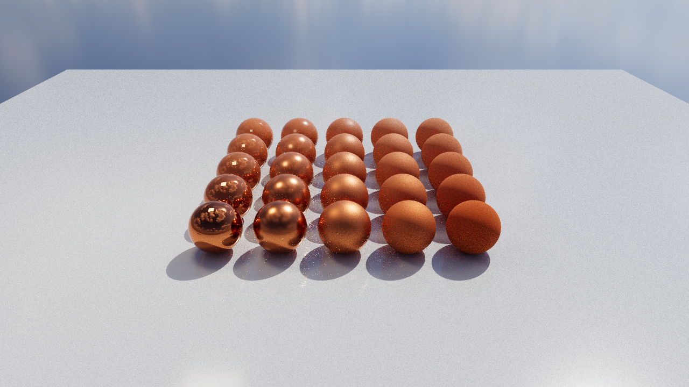
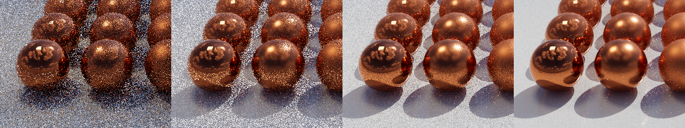
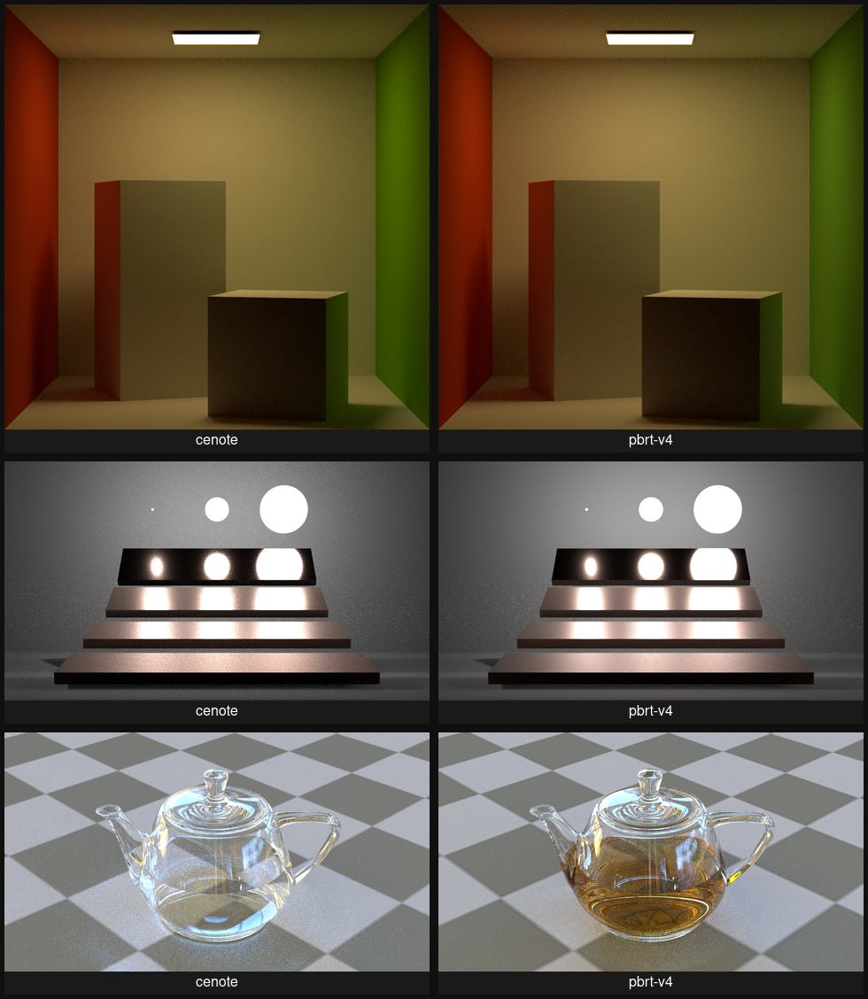
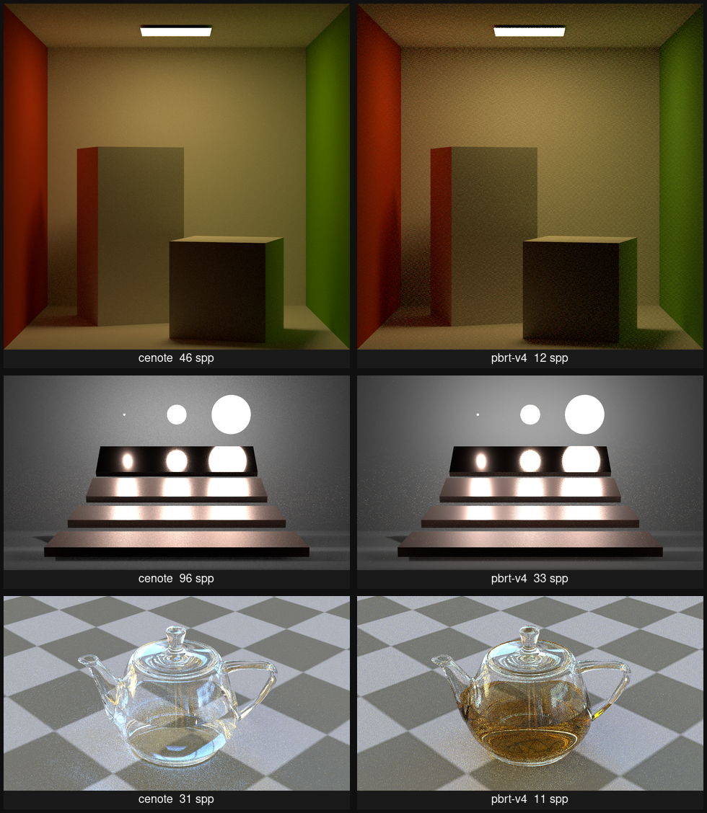

# Cenote

A portable, GPU-first, interactive-progressive production path tracer built on
Vulkan ray tracing. One estimator, all the way down: the preview and the final
frame are the same path tracer at different sample counts — no biased preview
mode, no final-gather switch — so what the artist sees at one second is an
honest prediction of the frame at one hour.

Where CPU production renderers optimize for memory capacity on unbounded scenes,
Cenote makes the inverse bet: extreme single-GPU performance on scenes that fit in
VRAM.

A wavefront engine driven by indirect dispatch with no mid-frame readbacks;
Sobol-Burley sampling; the full `OpenPBR` closure, energy-compensated against
baked tables so a white furnace closes through every lobe; bindless
BC-compressed textures; MIS-weighted next-event estimation of emissive meshes,
delta lights, and an importance-sampled HDRI; denoiser guides and first-hit
depth written beside the beauty as one multi-layer EXR; a pbrt-v4 importer;
live-editable scene files; a progressive viewer and a batch CLI that writes
exactly the image the viewer converges to.

`cenote-server` and `hdCenote` put that engine behind a loopback-TCP change-set
protocol and a scene-index-native Hydra render delegate, rendering live inside
`usdview` and batch through `usdrecord` and `husk` — see
[hydra/README.md](hydra/README.md).

Don't reach for **ReSTIR**: this renderer carried it, and at equal wall clock it
measured 2.6–4.8× *less* efficient than the path tracer it sat on — better per
sample, but a reservoir sample cost 5–6× what it saved. The implementation and
the measurements that retired it are on the
[`restir-archive`](../../tree/restir-archive) branch.



*A material chart sweeping `OpenPBR` roughness (left to right) and metalness
(back to front) under the Kloofendal sky's sun and a warm quad key light. The
spheres are coarse meshes shaded smooth by interpolated vertex normals — the
mirror-sharp front row is where a shading-normal or energy bug would show first.*



*1, 8, 64, and 512 spp*

## Next to pbrt-v4

The importer's real test is a side-by-side. Below are the three
regression-corpus scenes (Benedikt Bitterli's, CC0) imported and rendered
by cenote, beside [pbrt-v4](https://github.com/mmp/pbrt-v4) rendering the
same source files. Both images take the same sRGB display transform.



*64 samples per pixel. Cenote's `OpenPBR` conductor is not pbrt's spectral one, so
the Veach plates catch the light a little differently, and cenote has no volumetric
medium yet, so the teapot's tea looks like plain glass. pbrt reconstructs with a
triangle filter where cenote uses a box, so at matched samples its per-pixel noise
sits slightly lower.*



*Equal time — about a quarter second each, both on one RTX 4070 Ti SUPER. Cenote
draws 46, 96, and 31 spp against pbrt's 12, 33, and 11.*

| Scene | Resolution | pbrt-v4 | cenote | per sample |
|---|---|---|---|---|
| `cornell-box` | 1024² | 21.7 ms/spp | 5.5 ms/spp | 3.9× |
| `veach-mis` | 1280×720 | 7.6 ms/spp | 2.6 ms/spp | 2.9× |
| `teapot-full` | 1280×720 | 23.0 ms/spp | 8.0 ms/spp | 2.9× |

*Steady-state cost per sample, both engines on one NVIDIA RTX 4070 Ti SUPER
(pbrt-v4 through its OptiX wavefront back end).*

pbrt renders spectrally and writes linear `Rec.709`; cenote renders RGB in
`ACEScg`. The reference is pbrt-v4 at
[`5f7a606`](https://github.com/mmp/pbrt-v4/commit/5f7a606806a4ac7b939131ded9d7a30ebd02416e).

### The research corpus

Beyond the three CI scenes, `scenes/corpus/` carries nineteen of the scenes the
rendering literature measures on — Veach's ajar door, the Bistro, San Miguel,
Zero-Day, Kroken, Watercolor — imported from their official pbrt-v4 sources and
curated into cenote `.ron` files, each checked against a side-by-side pbrt-v4
reference. The divergences that survived are the renderer's gap list, tabulated
in [scenes/corpus/README.md](scenes/corpus/README.md).

## Quickstart

Requires: stable Rust, [`slangc`](https://github.com/shader-slang/slang) on PATH
(CI pins 2026.9.1; any recent release should work),
[OpenImageDenoise](https://github.com/RenderKit/oidn/releases) (CI pins 2.4.1 —
see [Denoising](#denoising)), and a Vulkan GPU with `VK_KHR_ray_query` support
(any recent RT-capable card).

```sh
cargo run --release -p cenote-viewer   # orbit (drag), dolly (scroll), live exposure
cargo run --release -p cenote-viewer -- scenes/example.ron   # open a scene file — and edit it live
cargo run --release -p cenote-cli -- render --spp 256 --out shot.exr
cargo run --release -p cenote-cli -- import scene.pbrt --out scene.ron   # pbrt-v4 in, cenote scene out
```

### Statistics

Every `render` ends with a summary — per-kernel GPU time, how much of the
frame was actually inside a dispatch, time-to-first-ray and
time-to-first-pixel, and device memory in four buckets (scene, film,
textures, scratch) — printed to the console and written beside
the image as `shot.stats.ron` so two runs diff as text. The viewer shows the
same numbers live.

```sh
cargo run --release -p cenote-cli -- render --spp 64 --out shot.exr   # summary + shot.stats.ron
cargo run --release -p cenote-cli -- render --spp 64 --out shot.exr --stats-trace settle.ron
scripts/benchmark.sh captures/               # the five-scene set, one sidecar each
```

The per-kernel breakdown is sampled one frame in 32, which holds the whole
instrument at **+1.9%** on the cheapest frames; the frame-time distribution is
drawn from the unsampled frames, so it reports what the renderer costs when
nothing is watching. `--no-gpu-timers` is the other arm of that A/B and
`--no-stats` turns the output off. `crates/cenote/src/gpu/timing.rs` has the
measurements behind the sampling rate.

### Denoising

[Open Image Denoise](https://www.openimagedenoise.org/) is fed by the film's
albedo and normal AOV guides:

```sh
cargo run --release -p cenote-cli -- render --spp 64 --denoise --out shot.exr
cargo run --release -p cenote-viewer    # the panel's denoise toggle
```

`--denoise` writes a second EXR (`shot.denoised.exr`) beside the raw one —
the estimator's output is never replaced.

The viewer's toggle is a scene setting (`denoise`, on by default there and
off everywhere else), and the render session filters the frames it
publishes — in the frames' own GPU memory where the driver allows
(`VK_KHR_external_memory_fd`; OIDN imports the buffers once and filters
them in place, nothing crosses the bus), through staging copies where it
does not. Denoising is a *view* of the film, so the switch never disturbs
the accumulation: flipping it republishes the same samples, filtered or
raw. Filtered frames go out on the sample count doubling — 1, 2, 4, 8 —
which puts a clean image up immediately after every edit and then costs
about 15% out to 64 spp. Moving frames filter at OIDN's `fast` quality and
settled ones at `high`, and the filter counts toward the interactive
resolution target the same way a sample does — so a drag with denoising on
holds its cadence at a smaller rectangle, soft and clean rather than sharp
and noisy.

Through Hydra the same switch is the render setting `cenote:denoise`, read
from the host's settings map or from the shot's own `UsdRenderSettings`
prim, and **off** unless one of them asks for it: a host that renders to
disk is handed the estimator's own pixels until it says otherwise. The
delegate's resolved-settings line names which it delivered.

**Install an official release, not your distro's package.** OIDN's speed is
entirely its device: on an RTX 4070 Ti SUPER the CPU device filters 1080p in
458 ms and the GPU device in 11 — 15 ms for the whole round trip, upload
through read-back. Each GPU backend ships as a separate
`libOpenImageDenoise_device_*.so` that distro packages routinely omit
(Fedora's carries CPU and HIP only), and OIDN falls back to the CPU without
complaint — so cenote opens the device by the *Vulkan device UUID* it is
rendering on, which both pins the filter to the right GPU on a multi-GPU
machine and picks the backend by hardware rather than by name. Landing on
the CPU logs a warning.

Point `OIDN_DIR` at a directory whose `lib/` holds the release's libraries,
and put that `lib/` on the loader's path. Setting them once in
`~/.cargo/config.toml` covers every build:

```toml
[env]
OIDN_DIR = "/home/you/.local/opt/oidn-2.4.1.x86_64.linux"
```

(A pkg-config install is found without `OIDN_DIR` — but check what devices it
ships before trusting it.)

## Tests and goldens

```sh
cargo test --workspace
```

runs everything; tests that need a GPU skip cleanly (with a note on stderr)
where there isn't one. The golden-image tests render the demo scene and
compare it against the reference EXRs in `crates/cenote/tests/golden/` with
[ꟻLIP](https://github.com/NVlabs/flip), a perceptual metric whose threshold
survives the floating-point reordering that driver and compiler updates cause.
A failure dumps the actual render and a FLIP heatmap (black = identical,
bright = different) into `target/tmp/` — open them in `tev` next to the golden.

After an **intentional** image change, regenerate the goldens and eyeball them
before committing:

```sh
UPDATE_GOLDENS=1 cargo test -p cenote --test golden        # the demo scene
UPDATE_GOLDENS=1 cargo test -p cenote-pbrt --test corpus   # the pbrt corpus
```

### Pre-push ritual

CI has no GPU, so everything image-shaped runs here, before pushing:

```sh
cargo fmt --all --check
cargo clippy --workspace --all-targets -- -D warnings
cargo test --workspace   # on the GPU machine — includes the goldens
```

## Repo map

| Path | What lives there |
|---|---|
| `crates/cenote/` | The core renderer library — start at `src/lib.rs`, whose crate doc is the architecture map |
| `crates/cenote/shaders/` | Slang GPU kernels — the heart of the renderer |
| `crates/cenote-cli/` | Headless binary: batch renders, pbrt import |
| `crates/cenote-pbrt/` | pbrt-v4 importer library — a client of the core's public scene API |
| `crates/cenote-server/` | Out-of-process render server: loopback-TCP request/response around `render::Session`, shared-memory framebuffer |
| `crates/cenote-viewer/` | Interactive viewer binary: live render in a window, orbit camera, progressive accumulation, stats/controls overlay, live-editable scene files |
| `crates/cenote-wire/` | The render server's wire: explicit change-set mirror types, MessagePack framing, the shm layout — and the byte-exact cross-language drift guard |
| `hydra/` | The C++ half: the `hdCenote` scene-index-native Hydra render delegate, its transport client, and the C++ wire mirror with the drift-guard corpus test (see its README) |
| `scenes/` | Hand-written example scenes — the scene model in readable `.ron` files |
| `scenes/corpus/` | The research-scene corpus (see its README) |
| `tests/scenes/` | The vendored CC0 pbrt corpus wired into CI (see its README for provenance) |
| `scripts/` | `benchmark.sh` renders the benchmark scene set; `hydra-check.sh` is the C++ pre-push gate |

## Non-goals

Deliberately out of scope, so nobody spends a weekend adding one:

- No CPU fallback renderer, and no OpenCL/CUDA/Metal backends.
- No vendor extensions in core paths — Vulkan KHR only, so any RT-capable GPU works.
- No out-of-core geometry or textures. The scene fits in VRAM or fails loudly.
- No bidirectional, photon-mapping, or VCM integrators. There is exactly one
  integrator; features are stages inside it, not systems beside it.
- No arbitrary shader graphs. Materials are the fixed `OpenPBR` closure.
- No API stability, plugin SDK, or third-party-user support.
- Nothing biased. A shortcut that breaks preview-predicts-final breaks the thesis.

## License

Dual-licensed under [MIT](LICENSE-MIT) or [Apache 2.0](LICENSE-APACHE), at your option.
