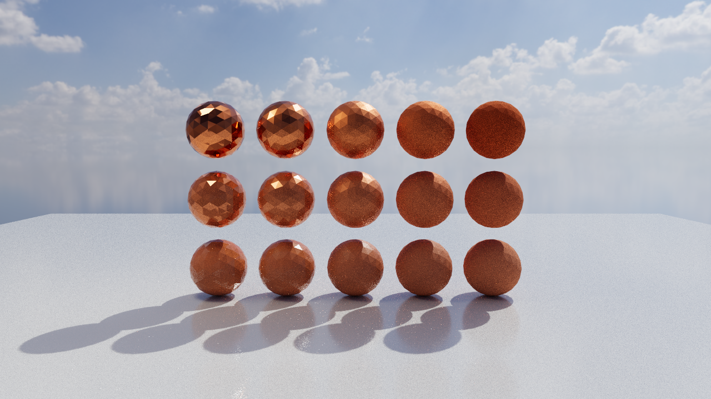
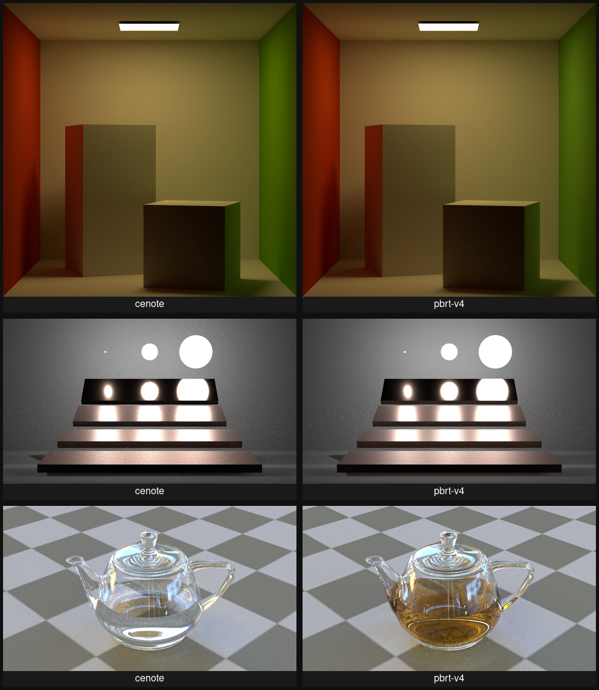
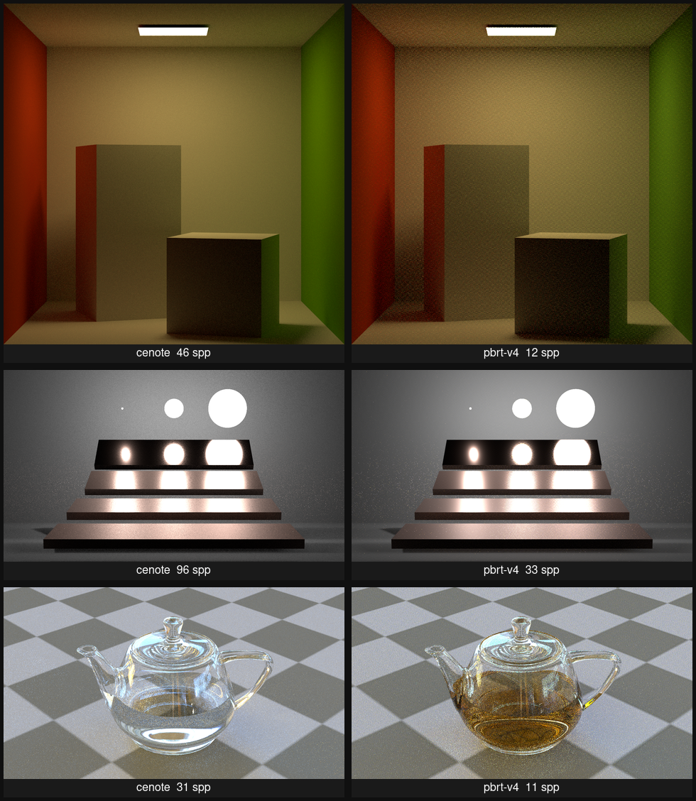
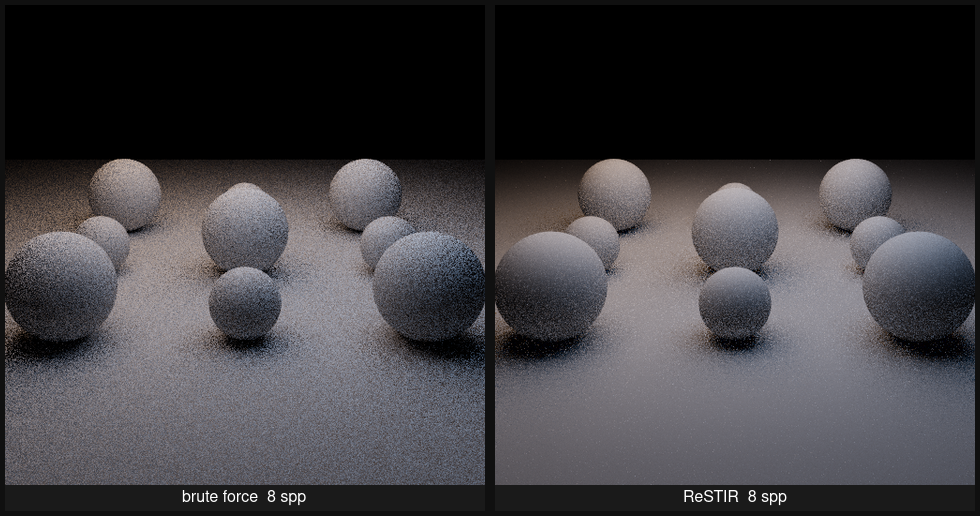
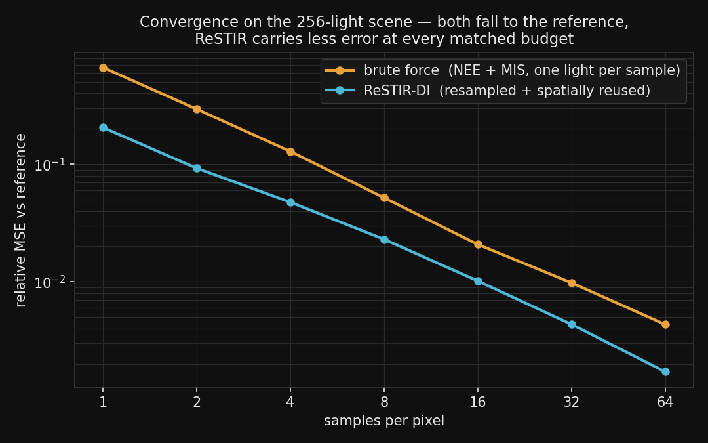
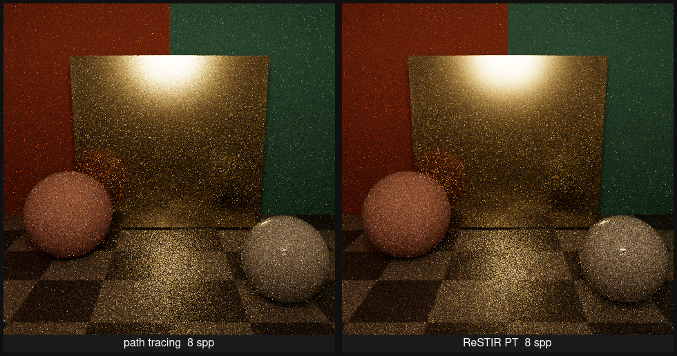
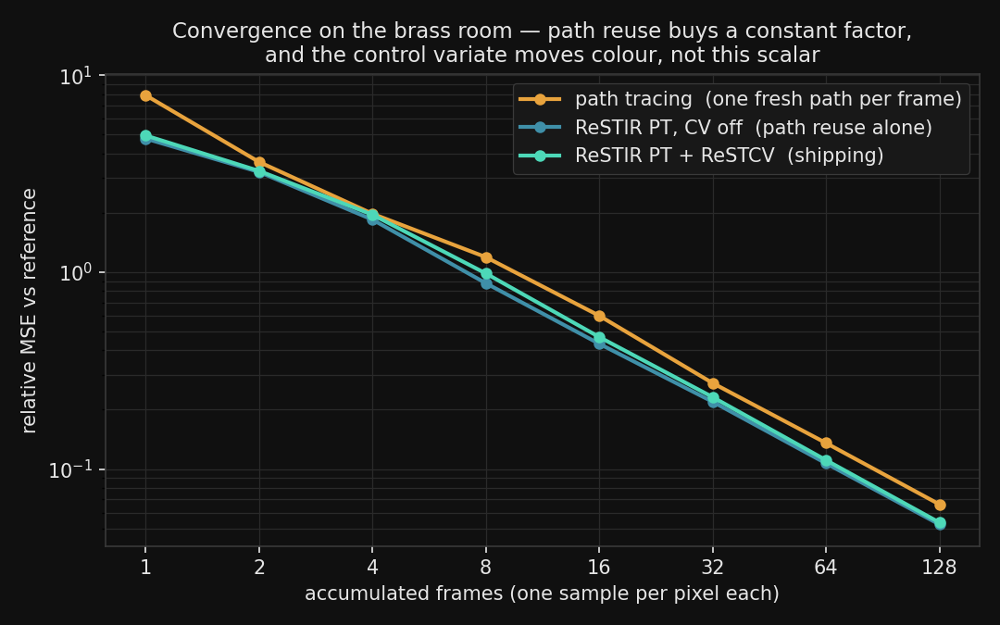

# Cenote

A portable, GPU-first, interactive-progressive production path tracer built on Vulkan
ray tracing, with GRIS/ReSTIR as its theoretical core. An exploration into how ReSTIR 
can benefit lookdev for offline rendering. What the artist sees at one second is an 
honest prediction of the frame at one hour.[^estimator]

Where CPU production renderers optimize for memory capacity on unbounded scenes,
Cenote makes the inverse bet: extreme single-GPU performance on scenes that fit in
VRAM.

**Status: M6 complete** — the wavefront engine
(indirect dispatch, zero mid-frame readbacks), Sobol-Burley sampling, the
full `OpenPBR` closure — coat, fuzz, rough glass with interior absorption,
thin-walled surfaces, variable IOR, fractional opacity — energy-compensated
against baked tables so a white furnace closes through every lobe, textured
materials through a bindless table (BC-compressed at prep with a DDS cache
beside each source, sRGB decoded in hardware, converted to the working
space in-shader) including tangent-space normal maps and per-texel opacity,
MIS-weighted next-event estimation of emissive meshes, delta lights, and an
importance-sampled HDRI, thin-lens depth of field, live-editable scene
files, a pbrt-v4 importer (`cenote-cli import`, or open a `.pbrt` in the
viewer directly) with a CC0 regression corpus rendered and FLIP-compared in
CI, AOVs (denoiser albedo/normal guides with Cycles-style specular
pass-through, first-hit depth) accumulated beside the beauty and written as
one multi-layer EXR, OIDN denoising over those guides (a CLI flag and a
viewer toggle, in builds with the `denoise` feature), a progressive viewer,
and a batch CLI that writes exactly the image the viewer converges to.

M3 added the renderer's theoretical core — **ReSTIR-DI**: screen-space
reservoir resampling at the primary hit, spatial and temporal reuse folded
under defensive pairwise MIS, unbiased by construction so it converges to the
very image the path tracer does and gets there faster where the lights are
many ([below](#many-lights-resampled)). M6 grew that reservoir from a light
sample to a whole light path — **ReSTIR PT**, reconnection and replay shifts
carrying indirect paths between pixels and across frames, with a ReSTCV
control variate over the top ([below](#paths-resampled)).

Between them, **M4 shipped the pipeline story**
([docs/m4-plan.md](docs/m4-plan.md)): `cenote-wire` (the explicit wire mirror
of the change-set schema), `cenote-server` (loopback TCP around
`render::Session`, pixels through a lock-free shared-memory framebuffer,
converted to `Rec.709` server-side), the byte-exact cross-language drift
guard, and `hdCenote` — a scene-index-native Hydra render delegate rendering
live inside `usdview` and batch through `usdrecord` and `husk` (see
[hydra/README.md](hydra/README.md)). M5 — geometry depth: subdivision, hair —
is deferred; ReSTIR PT outranked it when a rendering-research target became
primary ([docs/m6-plan.md](docs/m6-plan.md)).



*The M1 demo: a material chart sweeping `OpenPBR` roughness (left to right)
and metalness (back to front), path traced under the Kloofendal sky's sun
and a warm quad key light. The spheres are coarse meshes shaded smooth by
interpolated vertex normals — the mirror-sharp front row is where a
shading-normal or energy bug would show first.*


*1, 8, 64, and 512 spp*

## Next to pbrt-v4

The importer's real test is a side-by-side. Below are the three
regression-corpus scenes (Benedikt Bitterli's, CC0) imported and rendered
by cenote, beside [pbrt-v4](https://github.com/mmp/pbrt-v4) rendering the
same source files. Both images take the same sRGB display transform.



*64 samples per pixel.  Cenote's `OpenPBR` conductor is not pbrt's spectral one, so
the Veach plates catch the light a little differently. And cenote has no volumetric 
medium yet, so the teapot's tea looks like plain glass. pbrt reconstructs with a 
triangle filter where cenote uses a box, so at matched samples its per-pixel noise 
sits slightly lower.*



*Equal time — about a quarter second of rendering each, both on one RTX 4070
Ti SUPER. In that quarter second cenote draws three to four times the
samples — 46, 96, and 31 spp against pbrt's 12, 33, and 11 — and its grain is
plainly the finer. The gap is throughput, not hardware: same GPU, same
scene, same seconds.*

| Scene | Resolution | pbrt-v4 | cenote | per sample |
|---|---|---|---|---|
| `cornell-box` | 1024² | 21.7 ms/spp | 5.5 ms/spp | 3.9× |
| `veach-mis` | 1280×720 | 7.6 ms/spp | 2.6 ms/spp | 2.9× |
| `teapot-full` | 1280×720 | 23.0 ms/spp | 8.0 ms/spp | 2.9× |

*Steady-state cost per sample, both engines on one NVIDIA RTX 4070 Ti SUPER
(pbrt-v4 through its OptiX wavefront back end).*

pbrt renders spectrally and writes linear `Rec.709`; cenote renders RGB in
`ACEScg`.The reference is pbrt-v4 at
[`5f7a606`](https://github.com/mmp/pbrt-v4/commit/5f7a606806a4ac7b939131ded9d7a30ebd02416e).

## Many lights, resampled

ReSTIR is cenote's theoretical core, and the many-light scene is the case it
exists for: 256 small emitters raining light onto a cluster of matte occluders
under a black sky. The M2 path tracer meets it by next-event estimation — one
of the 256 lights drawn per sample and shadowed. A single draw among that many
is mostly wasted, so the image arrives as a storm of shadow grain. ReSTIR
resamples instead: each pixel keeps a running reservoir of the good light
samples it and its neighbours have found, spends one shadow ray confirming the
survivor, and reuses the rest. Same integrator, same lights, one shadow ray at
the primary hit either way — the samples just land where they carry the image.
(M3 shipped this as ReSTIR-DI, a reservoir of light samples; since M6 the same
`--restir` runs the unified path estimator, for which a light sample is the
length-2 case — the figures below are its DI regime, re-rendered by it.)



*Equal samples — 8 spp, one shadow ray at the primary hit either way. Left, the
path tracer's lone next-event draw among 256 lights; right, ReSTIR resampling
and borrowing its neighbours'. Same budget, and the grain on the right is
plainly the finer.*



*The convergence behind that image: relative MSE against a converged reference,
both estimators on the same scene. Both fall — ReSTIR is unbiased, so it
descends toward the very image brute force does[^estimator] — and ReSTIR carries
visibly less error at every matched sample budget. That constant gap is the
whole method: the variance reduction, measured rather than promised.*

Both curves are pinned by a test (`crates/cenote/tests/convergence.rs`), and at
converged samples the two estimators agree to ~1e-4 per channel — so the ReSTIR
image rides the same FLIP goldens the path tracer does. The scene ships as
inspectable data, so the comparison reproduces:

```sh
cargo run --release -p cenote-cli -- render scenes/many-lights.ron --restir --spp 256 --out many-lights.exr
```

## Paths, resampled

M6 grows the reservoir from a light sample to a whole path — **ReSTIR PT**.
The flagship scene is the case direct lighting cannot cover: a closed room
whose one warm lamp hangs under a dark iron shade, so nearly everything the
camera sees is lit by the bounce off a rough brass panel. A path tracer must
stumble onto lamp → panel → surface by luck, every pixel, every frame; ReSTIR
PT keeps the lucky paths in the same per-pixel reservoirs, carries them to
neighbouring pixels through a hybrid shift (reconnect where the geometry is
forgiving, replay the path where it is not), and hands them forward across
frames. The good path found once gets spent many times.



*Equal samples — 8 spp each, cenote's own display transform. Light in this
room is one bounce deep at minimum, so both sides are still noisy this early —
but the ReSTIR side carries 1.375× less relative error (measured at this
budget, each estimator against the other's converged reference), and the wash
on the panel and floor is already legible.*



*The layered curve: each line adds one mechanism, and the references are
cross-estimator so shared samples can't flatter the tail. Path reuse buys a
constant factor over the path tracer at every budget. The shipping control
variate (ReSTCV) rides the reuse line rather than dropping below it — by
construction it leaves per-pixel luminance untouched and repairs colour
noise, which a scalar error metric cannot see; its temporal warm-up costs a
few percent early and anneals to ~2% by 128 frames.*

The economics, stated plainly: a ReSTIR PT frame costs about 4× a
brute-force sample on this scene (≈5.4 ms against ≈1.4 ms per spp at 512² on
an idle RTX 4070 Ti SUPER, min-of-N two-point differencing — the candidate
stream and the path walk are real work), so at matched
*seconds* on a still frame, the plain path tracer currently wins: its
stratified sampler converges super-linearly as accumulation walks the sample
sequence in order, while resampling trades that structure away for reuse.
Reuse pays per *sample* — and per *frame* in the interactive regime the
viewer lives in, where a warm-started reservoir survives the camera motion
that resets accumulation. That trade is the bet the renderer makes, and the
numbers above are what it costs on a tripod.

The regime is pinned in CI by the same protocol as the many-light gate
(`crates/cenote/tests/convergence.rs`), and every mechanism in the curve is
a CLI toggle (`--no-spatial`, `--no-temporal`, `--no-cv`), so the comparison
reproduces:

```sh
cargo run --release -p cenote-cli -- render scenes/brass-room.ron --restir --spp 8 --out brass-room.exr
```

## Quickstart

Requires: stable Rust, [`slangc`](https://github.com/shader-slang/slang) on PATH
(CI pins 2026.9.1; any recent release should work), and a Vulkan GPU with
`VK_KHR_ray_query` support (any recent RT-capable card).

```sh
cargo run --release -p cenote-viewer   # orbit (drag), dolly (scroll), live exposure
cargo run --release -p cenote-viewer -- scenes/example.ron   # open a scene file — and edit it live
cargo run --release -p cenote-cli -- render --spp 256 --out shot.exr
cargo run --release -p cenote-cli -- import scene.pbrt --out scene.ron   # pbrt-v4 in, cenote scene out
```

### Denoising

Builds with the `denoise` feature add [Open Image
Denoise](https://www.openimagedenoise.org/), fed by the film's albedo and
normal AOV guides:

```sh
cargo run --release -p cenote-cli --features denoise -- render --spp 64 --denoise --out shot.exr
cargo run --release -p cenote-viewer --features denoise    # panel gains a denoise toggle
```

`--denoise` writes a second EXR (`shot.denoised.exr`) beside the raw one —
the estimator's output is never replaced. The viewer's toggle re-denoises
the accumulating frame about once a second.

The feature links the system OpenImageDenoise library. If your install has
a pkg-config file the build finds it alone; otherwise point `OIDN_DIR` at a
directory whose `lib/` contains `libOpenImageDenoise.so` — an extracted
[official release](https://github.com/RenderKit/oidn/releases), or a
symlink to your distro's versioned library (Setting it once in
`~/.cargo/config.toml` covers every build:

```toml
[env]
OIDN_DIR = "/home/you/.local/opt/oidn"
```

## Tests and goldens

```sh
cargo test --workspace
```

runs everything; tests that need a GPU skip cleanly (with a note on stderr)
where there isn't one. The golden-image tests render the demo scene and
compare it against the reference EXRs in `crates/cenote/tests/golden/` with
[ꟻLIP](https://github.com/NVlabs/flip), a perceptual metric whose threshold
survives the floating-point reordering that driver and compiler updates cause.
A failure dumps the actual render and a FLIP heatmap (black = identical,
bright = different) into `target/tmp/` — open them in `tev` next to the golden.

After an **intentional** image change, regenerate the goldens and eyeball them
before committing:

```sh
UPDATE_GOLDENS=1 cargo test -p cenote --test golden        # the demo scene
UPDATE_GOLDENS=1 cargo test -p cenote-pbrt --test corpus   # the pbrt corpus
```

### Pre-push ritual

CI has no GPU, so everything image-shaped runs here, before pushing:

```sh
cargo fmt --all --check
cargo clippy --workspace --all-targets -- -D warnings
cargo test --workspace   # on the GPU machine — includes the goldens
```

## Repo map

| Path | What lives there |
|---|---|
| `crates/cenote/` | The core renderer library — start at `src/lib.rs`, whose crate doc is the architecture map |
| `crates/cenote/shaders/` | Slang GPU kernels — the heart of the renderer |
| `crates/cenote-cli/` | Headless binary: batch renders, pbrt import |
| `crates/cenote-pbrt/` | pbrt-v4 importer library — a client of the core's public scene API |
| `crates/cenote-server/` | Out-of-process render server: loopback-TCP request/response around `render::Session`, shared-memory framebuffer (M4) |
| `crates/cenote-viewer/` | Interactive viewer binary: live render in a window, orbit camera, progressive accumulation, stats/controls overlay, live-editable scene files |
| `crates/cenote-wire/` | The render server's wire: explicit change-set mirror types, MessagePack framing, the shm layout — and the byte-exact cross-language drift guard |
| `hydra/` | The C++ half of M4 — the `hdCenote` scene-index-native Hydra render delegate, its transport client, and the C++ wire mirror with the drift-guard corpus test (see its README) |
| `scenes/` | Hand-written example scene — the scene model in one readable `.ron` file |
| `tests/scenes/` | The vendored CC0 pbrt corpus (see its README for provenance) |
| `docs/charter.md` | Project charter: vision, locked decisions, milestone roadmap |
| `docs/decisions.md` | Append-only log of every design decision and its rationale |
| `docs/m0-plan.md` | The M0 implementation plan |
| `docs/m1-plan.md` | The M1 implementation plan |
| `docs/m2-plan.md` | The M2 implementation plan |
| `docs/m3-plan.md` | The M3 implementation plan |
| `docs/m4-plan.md` | The M4 implementation plan |
| `docs/m6-plan.md` | The M6 implementation plan (ReSTIR PT — full path reuse; M5 geometry depth deferred) |
| `docs/deferrals.md` | Living ledger of consciously deferred production features and their revival triggers |

## License

Dual-licensed under [MIT](LICENSE-MIT) or [Apache 2.0](LICENSE-APACHE), at your option.

[^estimator]: Honest at the level that matters — the converged still. Frame to
    frame the preview and the final are not literally one estimator: while the
    camera moves, the preview warm-starts from the previous frame's reservoirs
    (temporal reuse); on a held camera that reuse decays to nothing and the
    frame converges spatial-only with fresh per-frame randomness — independent
    unbiased samples averaging to the same image a brute-force path trace
    produces. There is no biased preview mode and no final-gather switch, only
    reuse that is provably annealed away as the still resolves.
